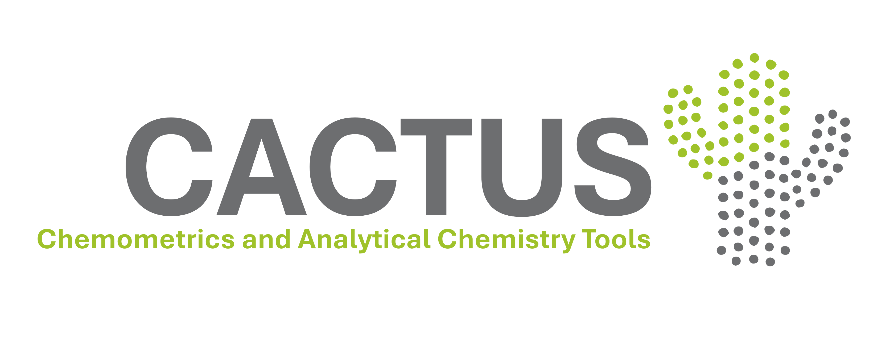

### Chemometrics and Analytical Chemistry Tools

**A user-friendly, no-code desktop application for chemometrics, statistics and multivariate data analysis.**

 

[**Download Cactus**](#download) ·
[**User Guide**](#documentation) ·
[**Report a bug**](#support) ·
[**Request a feature**](#support)

---

**Cactus** is a cross-platform user-friendly desktop application for chemometrics and tabular data analysis, designed primarily for teaching and for researchers who want to apply statistical and multivariate methods without writing code.

It provides a complete, intuitive no-code environment for data import, preprocessing, statistical exploration, visualization, and modeling. The goal is to make chemometric workflows easier to use in both educational and research settings, while still giving users access to a broad range of analytical tools.

Cactus runs locally on **Windows**, **macOS**, and **Linux**, so datasets are processed directly on the user's computer without requiring external servers or cloud services.

---

## What you can do with Cactus

* **Import**: load tabular datasets from common formats, including `.csv`, `.txt`, and `.xlsx`

* **Edit Data**: manage variables and categories, remove selected data, handle missing values through imputation, and create training/test splits

* **Visualization**: explore data through univariate, bivariate, and multivariate plots

* **Statistical Exploration**: perform normality tests, t-tests, ANOVA, correlation analysis, and descriptive statistics

* **Preprocessing**: apply baseline correction, SNV, PQN, continuum removal, derivatives, binning, and other preprocessing techniques

* **Unsupervised Analysis**: explore data structure using PCA, HCA, K-means, t-SNE, and other methods

* **Supervised Modeling**: build classification models (LDA, QDA, KNN, PLS-DA), regression models (MLR, PCR, PLS), and one-class models (SIMCA)

---

## Download

Get the latest version of Cactus from the [Releases](https://github.com/Lebolebo95/Cactus/releases) page.

| Platform           | How to install                                                                                                                                                                                                                                        |
| ------------------ | ----------------------------------------------------------------------------------------------------------------------------------------------------------------------------------------------------------------------------------------------------- |
| **Windows**        | [Download `.exe`](https://github.com/Lebolebo95/Cactus/releases/latest/download/CactusSetup.exe) and run the installer, then follow the setup wizard                                                                                                  |
| **macOS**          | [Download `.dmg`](https://github.com/Lebolebo95/Cactus/releases/latest/download/CactusSetup.dmg), drag Cactus into Applications. On first launch: right-click the app → **Open** (needed because the app isn't yet signed with an Apple Developer ID) |
| **Linux (Ubuntu)** | [Download `.deb`](https://github.com/Lebolebo95/Cactus/releases/latest/download/CactusSetup.deb) and install from a terminal with `sudo apt install ./CactusSetup.deb` rather than double-clicking, so dependencies are resolved automatically        |

### System requirements

* Windows 10/11
* macOS on Apple Silicon
* Ubuntu 22.04 LTS or later

---

## Documentation

The full user guide can be found in the [`assets`](assets/) folder or downloaded directly as a [PDF](https://raw.githubusercontent.com/Lebolebo95/Cactus/main/assets/user_guide_CACTUS.pdf).

The guide provides detailed information about the Cactus interface, available analytical tools, and the main steps of the data analysis workflow.

---

## How to cite

If you use **Cactus** in scientific research, publications, presentations, or academic work, please cite the associated publication:

> Full citation and DOI information will be added here once the associated publication is available.

---

## Support

For **bug reports**, **feature requests**, or **general improvements**, please open an [Issue](https://github.com/Lebolebo95/Cactus/issues) on this repository. This allows suggestions and reported problems to be discussed, tracked, and potentially integrated into future releases.

If you prefer, you can also submit feedback, report a problem, or suggest an improvement through our [Google Form](https://docs.google.com/forms/d/e/1FAIpQLSfBnMWuFYRkiEdSFJSuWasNoXBfgMSjN2okS0CVmOpcxTsWww/viewform).

For **direct support** or other inquiries, you can contact us at [info_cactus@databloom.it](mailto:info_cactus@databloom.it).

---

## Custom development

**Cactus** was created as a free and accessible tool for the scientific and analytical community, and its core development is intended to remain focused on features that can benefit the broader user base.

For companies, laboratories, or research groups with specific requirements, we are also available for custom development, including dedicated features, workflow adaptations, integrations, or other modifications that may be too specialized to become part of the public version of **Cactus**.

For custom development or private inquiries, contact us at [info_cactus@databloom.it](mailto:info_cactus@databloom.it).

---

## License

Cactus is distributed under the [**GPL-3.0**](LICENSE) license.

---

## Developed in collaboration with

**Cactus** has been developed through the collaboration between the [**Department of Chemistry of the University of Turin**](https://www.chimica.unito.it/) and [**Databloom srl**](https://www.databloom.it/), combining academic research in chemometrics and analytical chemistry with software development and applied data science.

 

  
  
  

